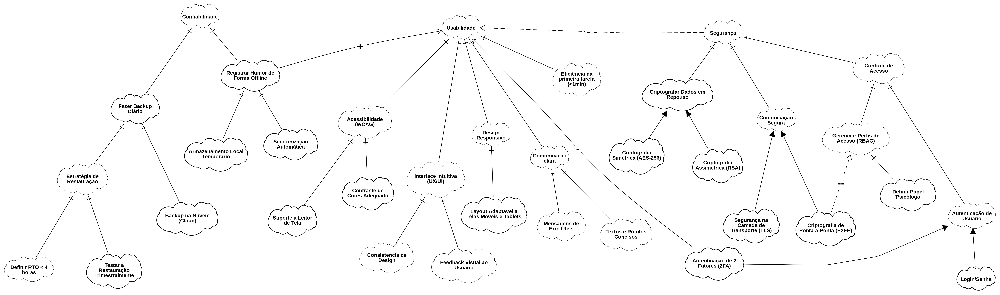

# Grafo de Interdependência de Softgoals (SIG)

Modelo de Requisitos Não Funcionais (RNFs) para o aplicativo "HumorHoje", com foco em três pilares de qualidade: **Confiabilidade**, **Usabilidade** e **Segurança**. 

## 1. Confiabilidade

O objetivo de **Confiabilidade** garante que o aplicativo seja robusto e que os dados do usuário estejam sempre seguros e disponíveis.

* **Objetivos Principais**: A confiabilidade é alcançada através de duas ações principais:

  * `Registrar Humor de Forma Offline`: Permite que o usuário utilize a principal funcionalidade do app mesmo sem conexão com a internet. Isso é decomposto em `Armazenamento Local Temporário` e `Sincronização Automática` quando a conexão for restabelecida.

  * `Fazer Backup Diário`: Garante a recuperação de dados em caso de falha.

* **Refinamento Detalhado**: O backup é detalhado com a `Estratégia de Restauração`, que por sua vez se torna concreta através de metas mensuráveis como `Definir RTO < 4 horas` (tempo para recuperar o sistema) e a tarefa recorrente de `Testar a Restauração Trimestralmente`. Isso transforma um conceito vago em um plano de ação claro.

## 2. Ramo de Usabilidade

O objetivo de **Usabilidade** foca em tornar o aplicativo fácil, eficiente e agradável de usar, o que é crucial para o engajamento diário.

* **Decomposição Abrangente**: A usabilidade é decomposta em vários sub-objetivos, como:

  * `Interface Intuitiva`: Refinada em `Consistência de Design` e `Feedback Visual ao Usuário`.

  * `Comunicação Clara`: Detalhada em `Mensagens de Erro Úteis` e `Textos e Rótulos Concisos`.

  * `Acessibilidade (WCAG)`: Operacionalizada com `Suporte a Leitor de Tela` e `Contraste de Cores Adequado`, alinhando-se ao requisito legal RL02.

  * `Design Responsivo`: Garantido por um `Layout Adaptável a Telas Móveis e Tablets`.

  * `Eficiência na primeira tarefa (<1min)`: Uma métrica de sucesso clara para a experiência inicial do usuário.

* **Contribuições Positivas**: O modelo mostra que `Registrar Humor de Forma Offline` contribui positivamente (`+`) para a **Usabilidade**, pois remove a barreira da necessidade de conexão constante.

## 3. Segurança

O objetivo de **Segurança** é proteger a privacidade e a integridade dos dados sensíveis do usuário, um ponto central para um aplicativo de saúde mental.

* **Decisões Críticas (Alternativas "OU")**: A segurança é modelada com escolhas explícitas que a equipe de desenvolvimento deve fazer:

  * **Criptografia de Dados em Repouso**: Oferece a escolha entre `Criptografia Simétrica (AES-256)` (mais rápida) e `Criptografia Assimétrica (RSA)` (potencialmente mais complexa).

  * **Comunicação Segura**: Apresenta a decisão fundamental entre `Segurança na Camada de Transporte (TLS)` e `Criptografia de Ponta-a-Ponta (E2EE)`.

  * **Autenticação de Usuário**: A escolha entre um simples `Login/Senha` ou a adição de `Autenticação de 2 Fatores (2FA)`.

* **Controle de Acesso Detalhado**: O `Controle de Acesso` é refinado para incluir `Gerenciar Perfis de Acesso (RBAC)`, que é operacionalizado pela tarefa de `Definir Papel 'Psicólogo'`, alinhando-se perfeitamente aos requisitos funcionais de acompanhamento profissional.

## 4. Conflitos e Trade-offs Revelados

A maior força deste grafo é expor os conflitos (trade-offs) que exigem decisões de design cuidadosas.

* **Segurança vs. Usabilidade (`--`)**: Este é um conflito clássico, aqui representado de forma explícita. O modelo mostra que adicionar `Autenticação de 2 Fatores (2FA)` para aumentar a segurança tem um impacto negativo (`-`) na **Usabilidade**, pois adiciona um passo extra para o usuário.

* **O Conflito Central: E2EE vs. Acesso de Psicólogo (`--`)**: O grafo revela o principal dilema arquitetônico do projeto.

  * A `Criptografia de Ponta-a-Ponta (E2EE)` oferece o nível máximo de privacidade, tornando os dados ilegíveis até mesmo para o servidor.

  * No entanto, o `Gerenciar Perfis de Acesso (RBAC)`, necessário para que psicólogos acessem os dados dos pacientes, é funcionalmente incompatível com a E2EE.

  * A correlação fortemente negativa (`--`) entre esses dois nós força a equipe a tomar uma decisão fundamental: priorizar a privacidade absoluta do usuário ou a funcionalidade de acompanhamento profissional.
