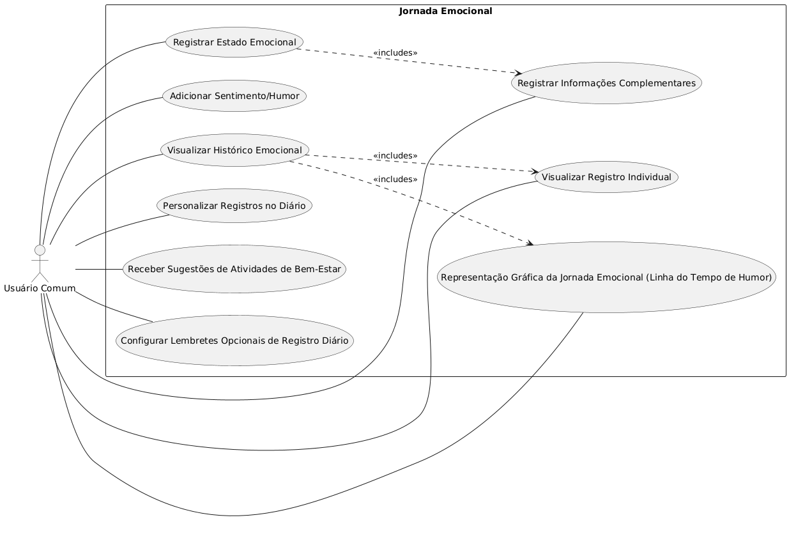
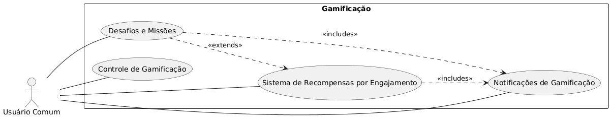
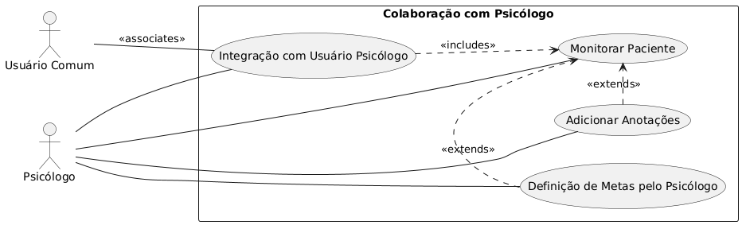
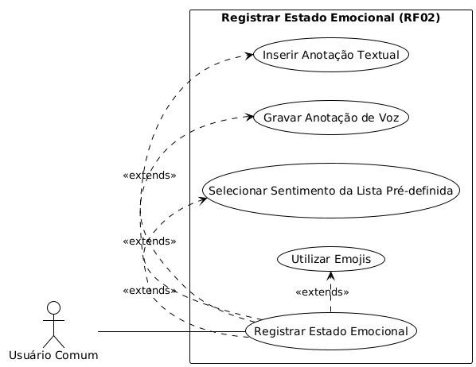
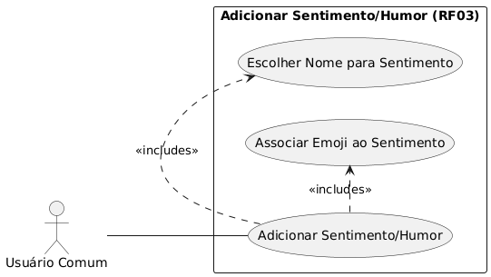
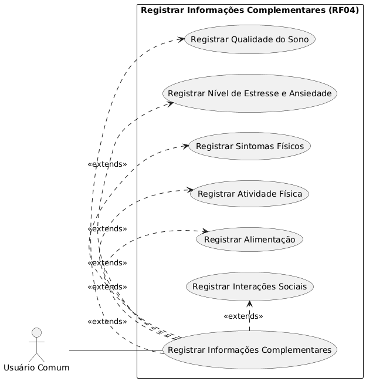
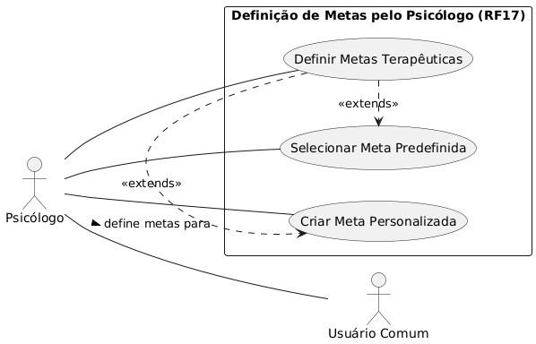

# Diagramas de Caso de Uso

## 1. Descrição Geral

Este documento apresenta os diagramas de caso de uso do sistema "HumorHoje", organizados por áreas de funcionalidade para facilitar a compreensão das interações dos usuários com o aplicativo.

## 2. Diagramas de Visão Geral

### 2.1. Jornada Emocional

Este diagrama oferece umaa visão geral das principais funcionalidades relacionadas ao registro e acompanhamento do estado emocional do usuário comum.

### 2.2. Gamificação

Este diagrama apresenta uma visão geral das funcionalidades de gamificação, incluindo recompensas, desafios e seu controle.

### 2.3. Colaboração com Psicólogo

Este diagrama fornece uma visão geral das interações entre o Usuário Comum e o Psicólogo dentro do sistema.

## 3. Diagramas de Casos de Uso Detalhados

### 3.1. Detalhes do Caso de Uso: Registrar Estado Emocional (RF02)

Este diagrama detalha os diversos métodos que o usuário pode utilizar para registrar seu estado emocional.

### 3.2. Detalhes do Caso de Uso: Adicionar Sentimento/Humor (RF03)

Este diagrama especifica as opções de personalização ao adicionar um sentimento ou humor ao sistema.

### 3.3. Detalhes do Caso de Uso: Registrar Informações Complementares (RF04)

Este diagrama lista os tipos específicos de informações complementares que o usuário pode registrar junto ao humor.

### 3.4. Detalhes do Caso de Uso: Definição de Metas pelo Psicólogo (RF17)

Este diagrama detalha as ações do psicólogo ao definir metas terapêuticas para os pacientes.

